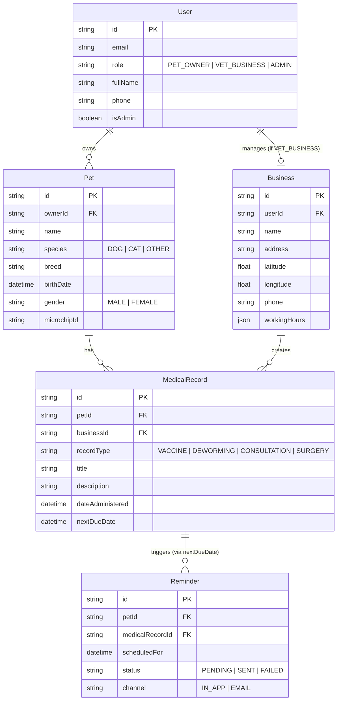

# Data Model & Schema Specification: PetPocket — MVP

**Feature Branch**: `001-petpocket-mvp`  
**Date**: 2026-08-01 (Corrected Scope)  
**Spec**: [spec.md](file:///c:/Users/erika/Desktop/Petpocket/specs/001-petpocket-mvp/spec.md)

---

## 1. Entity Relationship Overview



---

## 2. Prisma Schema Specification (`schema.prisma` extensions)

```prisma
enum Role {
  PET_OWNER
  VET_BUSINESS
  ADMIN
}

enum PetSpecies {
  DOG
  CAT
  OTHER
}

enum PetGender {
  MALE
  FEMALE
}

enum RecordType {
  VACCINE
  DEWORMING
  CONSULTATION
  SURGERY
}

enum ReminderStatus {
  PENDING
  SENT
  FAILED
}

// Extension to existing Open SaaS User model
model User {
  id                        String          @id @default(uuid())
  createdAt                 DateTime        @default(now())
  updatedAt                 DateTime        @updatedAt

  email                     String?         @unique
  username                  String?         @unique
  fullName                  String?
  phone                     String?
  role                      Role            @default(PET_OWNER)
  isAdmin                   Boolean         @default(false)

  // PetPocket Relations
  pets                      Pet[]
  business                  Business?
  
  // Existing Open SaaS relations preserved
  paymentProcessorUserId        String?     @unique
  lemonSqueezyCustomerPortalUrl String?
  subscriptionStatus            String?
  subscriptionPlan              String?
  datePaid                      DateTime?
  credits                       Int         @default(3)

  gptResponses                  GptResponse[]
  contactFormMessages           ContactFormMessage[]
  tasks                         Task[]
  files                         File[]
}

model Pet {
  id            String          @id @default(uuid())
  createdAt     DateTime        @default(now())
  updatedAt     DateTime        @updatedAt

  owner         User            @relation(fields: [ownerId], references: [id], onDelete: Cascade)
  ownerId       String

  name          String
  species       PetSpecies      @default(DOG)
  breed         String?
  birthDate     DateTime?
  gender        PetGender       @default(MALE)
  microchipId   String?

  medicalRecords MedicalRecord[]
  reminders      Reminder[]

  @@index([ownerId])
}

model Business {
  id            String          @id @default(uuid())
  createdAt     DateTime        @default(now())
  updatedAt     DateTime        @updatedAt

  owner         User            @relation(fields: [userId], references: [id], onDelete: Cascade)
  userId        String          @unique

  name          String
  description   String?
  address       String
  latitude      Float
  longitude     Float
  phone         String
  workingHours  Json            // Structured weekly operating hours

  medicalRecords MedicalRecord[]

  @@index([latitude, longitude])
}

model MedicalRecord {
  id               String          @id @default(uuid())
  createdAt        DateTime        @default(now())
  updatedAt        DateTime        @updatedAt

  pet              Pet             @relation(fields: [petId], references: [id], onDelete: Cascade)
  petId            String

  business         Business?       @relation(fields: [businessId], references: [id], onDelete: SetNull)
  businessId       String?

  recordType       RecordType      @default(VACCINE)
  title            String
  description      String?
  dateAdministered DateTime        @default(now())
  nextDueDate      DateTime?       // Set by VET_BUSINESS for next follow-up/control

  reminders        Reminder[]

  @@index([petId])
  @@index([businessId])
  @@index([nextDueDate])
}

model Reminder {
  id              String          @id @default(uuid())
  createdAt       DateTime        @default(now())
  updatedAt       DateTime        @updatedAt

  pet             Pet             @relation(fields: [petId], references: [id], onDelete: Cascade)
  petId           String

  medicalRecord   MedicalRecord?  @relation(fields: [medicalRecordId], references: [id], onDelete: Cascade)
  medicalRecordId String?

  scheduledFor    DateTime
  status          ReminderStatus  @default(PENDING)
  sentAt          DateTime?

  @@index([scheduledFor, status])
  @@index([petId])
}
```

---

## 3. Data Integrity & Validation Rules

1. **Clinical Follow-Up Link**: When a veterinary business registers a completed attention (`MedicalRecord`), they can set `nextDueDate`. The automated cron job inspects `nextDueDate` to schedule `Reminder` entries.
2. **Medical History Portability**: `MedicalRecord` links to `Pet` (owned by `User`). Changing or transferring clinic association preserves the owner's full medical history.
3. **Read-Only Access for Pet Owners**: Pet owners can query all `MedicalRecord` entries associated with their pets (`pet.ownerId === context.user.id`), but only `VET_BUSINESS` users can create or modify `MedicalRecord` entries.
4. **Spatial Index**: Index `@@index([latitude, longitude])` on `Business` optimizes distance calculations for nearby clinic discovery.
