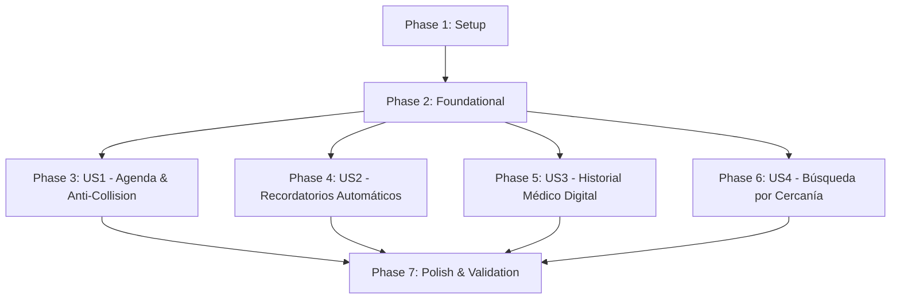

# Tasks: PetPocket — MVP

**Input**: Design documents from [`specs/001-petpocket-mvp/`](file:///c:/Users/TonyJ0711/Desktop/Documentos/petpocket/specs/001-petpocket-mvp/)  
**Prerequisites**: [`plan.md`](file:///c:/Users/TonyJ0711/Desktop/Documentos/petpocket/specs/001-petpocket-mvp/plan.md), [`spec.md`](file:///c:/Users/TonyJ0711/Desktop/Documentos/petpocket/specs/001-petpocket-mvp/spec.md), [`research.md`](file:///c:/Users/TonyJ0711/Desktop/Documentos/petpocket/specs/001-petpocket-mvp/research.md), [`data-model.md`](file:///c:/Users/TonyJ0711/Desktop/Documentos/petpocket/specs/001-petpocket-mvp/data-model.md), [`contracts/`](file:///c:/Users/TonyJ0711/Desktop/Documentos/petpocket/specs/001-petpocket-mvp/contracts/)

---

## Format: `[ID] [P?] [Story] Description`

- **[P]**: Can run in parallel (different files, no dependencies)
- **[Story]**: User story label (`US1`, `US2`, `US3`, `US4`)
- Includes exact file paths in all descriptions

---

## Phase 1: Setup (Shared Infrastructure)

**Purpose**: Verify and prepare Open SaaS project environment for PetPocket feature modules.

- [x] T001 Verify Wasp environment configuration and database connectivity in `main.wasp.ts` and `.env.server.example`
- [ ] T002 [P] Configure ESLint and Prettier rule verification in `eslint.config.js` and `prettier.config.ts`

---

## Phase 2: Foundational (Blocking Prerequisites)

**Purpose**: Core schema models, RBAC extensions, and base module structure that MUST be complete before ANY user story can be implemented.

**⚠️ CRITICAL**: No user story implementation can begin until this phase is complete.

- [ ] T003 Extend Prisma schema with `Role`, `PetSpecies`, `PetGender`, `AppointmentStatus`, `RecordType`, and `ReminderStatus` enums in `schema.prisma`
- [ ] T004 [P] Update Open SaaS `User` model with `role`, `fullName`, and `phone` attributes in `schema.prisma`
- [ ] T005 [P] Add `Pet`, `Business`, `Appointment`, `MedicalRecord`, and `Reminder` models to `schema.prisma`
- [ ] T006 Run Prisma database migration via `./tools/wasp db migrate-dev` to apply PetPocket schema modifications
- [ ] T007 [P] Implement RBAC helper functions for role validation (`PET_OWNER`, `VET_BUSINESS`, `ADMIN`) in `src/shared/rbac.ts`
- [ ] T008 Register PetPocket feature module specifications in `main.wasp.ts`

**Checkpoint**: Foundation ready - database models and RBAC infrastructure in place.

---

## Phase 3: User Story 1 - Agenda de citas automatizada para negocios (Priority: P1) 🎯 MVP

**Goal**: Enable veterinary clinics to set operating schedules and allow pet owners to book appointments with atomic anti-collision slot locking.

**Independent Test**: Register a business with open hours, log in as a pet owner, book a slot, and verify slot availability locks atomically while rejecting concurrent booking attempts.

### Tests for User Story 1 (TDD Mandatory)

- [ ] T009 [P] [US1] Write unit tests for atomic appointment slot locking transaction in `src/appointments/operations.test.ts`
- [ ] T010 [P] [US1] Write integration test for appointment reservation and cancellation flows in `src/appointments/appointments.test.ts`

### Implementation for User Story 1

- [ ] T011 [P] [US1] Create Wasp module declaration `src/appointments/appointments.wasp.ts` for actions (`createAppointment`, `cancelAppointment`) and queries (`getBusinessAvailability`, `getUserAppointments`, `getBusinessAppointments`)
- [ ] T012 [US1] Implement `getBusinessAvailability` query to calculate open schedule slots in `src/appointments/operations.ts`
- [ ] T013 [US1] Implement `createAppointment` action with Prisma atomic `$transaction` anti-collision lock in `src/appointments/operations.ts`
- [ ] T014 [US1] Implement `cancelAppointment` action to free schedule slot and notify business in `src/appointments/operations.ts`
- [ ] T015 [P] [US1] Build appointment booking UI component for pet owners in `src/appointments/views/BookingPage.tsx`
- [ ] T016 [P] [US1] Build veterinary business schedule management dashboard in `src/appointments/views/BusinessSchedulePage.tsx`

**Checkpoint**: User Story 1 fully functional and independently testable.

---

## Phase 4: User Story 2 - Recordatorios automáticos de vacunas y controles (Priority: P2)

**Goal**: Automatically generate and dispatch reminders for upcoming vaccinations and check-ups without manual staff outreach.

**Independent Test**: Create a medical record with an upcoming due date, execute the Wasp cron job, and verify reminder record creation and notification dispatch.

### Tests for User Story 2 (TDD Mandatory)

- [ ] T017 [P] [US2] Write unit tests for reminder calculation logic and cron triggers in `src/reminders/jobs.test.ts`

### Implementation for User Story 2

- [ ] T018 [P] [US2] Create Wasp module declaration `src/reminders/reminders.wasp.ts` for Wasp background cron job (`checkVaccineRemindersJob`) and queries (`getUserReminders`)
- [ ] T019 [US2] Implement `checkVaccineRemindersJob` background cron worker to scan upcoming medical due dates in `src/reminders/jobs.ts`
- [ ] T020 [US2] Implement reminder email/in-app notification dispatch mechanism in `src/reminders/operations.ts`
- [ ] T021 [P] [US2] Build pet owner reminder alert UI list component in `src/reminders/views/ReminderListPage.tsx`

**Checkpoint**: User Story 2 fully functional and independently testable.

---

## Phase 5: User Story 3 - Historial médico digital centralizado y portable (Priority: P3)

**Goal**: Provide pet owners with permanent, digital access to their pets' complete medical records across different veterinary clinics.

**Independent Test**: Vet clinic A enters a vaccination entry, pet owner views complete medical passport, and owner presents digital history at clinic B.

### Tests for User Story 3 (TDD Mandatory)

- [ ] T022 [P] [US3] Write unit tests for medical record authorization and RBAC ownership checks in `src/medical-records/operations.test.ts`

### Implementation for User Story 3

- [ ] T023 [P] [US3] Create Wasp module declaration `src/medical-records/medical-records.wasp.ts` for actions (`addMedicalRecord`) and queries (`getPetMedicalHistory`)
- [ ] T024 [US3] Implement `addMedicalRecord` action restricted to `VET_BUSINESS` role in `src/medical-records/operations.ts`
- [ ] T025 [US3] Implement `getPetMedicalHistory` query with pet owner access verification in `src/medical-records/operations.ts`
- [ ] T026 [P] [US3] Create Pet CRUD management module and queries (`getPets`, `createPet`) in `src/pets/operations.ts`
- [ ] T027 [P] [US3] Build digital medical passport UI view for pet owners in `src/medical-records/views/MedicalPassportPage.tsx`
- [ ] T028 [P] [US3] Build clinical entry form component for veterinary businesses in `src/medical-records/views/AddRecordModal.tsx`

**Checkpoint**: User Story 3 fully functional and independently testable.

---

## Phase 6: User Story 4 - Búsqueda de veterinarias cercanas (Priority: P4)

**Goal**: Allow pet owners to search and discover nearby registered veterinary clinics based on location coordinates.

**Independent Test**: Input latitude and longitude coordinates, and verify that nearby clinics return sorted by geographical distance.

### Tests for User Story 4 (TDD Mandatory)

- [ ] T029 [P] [US4] Write integration test for Haversine proximity search query in `src/businesses/operations.test.ts`

### Implementation for User Story 4

- [ ] T030 [P] [US4] Create Wasp module declaration `src/businesses/businesses.wasp.ts` for queries (`searchNearbyBusinesses`, `getBusinessProfile`) and actions (`updateBusinessProfile`)
- [ ] T031 [US4] Implement `searchNearbyBusinesses` raw SQL Haversine distance query in `src/businesses/operations.ts`
- [ ] T032 [US4] Implement `updateBusinessProfile` action for business address and geolocation coordinates in `src/businesses/operations.ts`
- [ ] T033 [P] [US4] Build location-based clinic search and map/list view component in `src/businesses/views/ClinicSearchPage.tsx`

**Checkpoint**: User Story 4 fully functional and independently testable.

---

## Phase 7: Polish & Cross-Cutting Concerns

**Purpose**: Integration verification, documentation updates, and validation against quickstart scenarios.

- [ ] T034 [P] Update navigation navbar and landing page with PetPocket role-based routing in `src/landing-page/LandingPage.tsx` and `src/client/App.tsx`
- [ ] T035 [P] Run linter and formatting checks via `npm run lint` and `npm run prettier:check`
- [ ] T036 Execute complete end-to-end quickstart validation scenarios documented in [`specs/001-petpocket-mvp/quickstart.md`](file:///c:/Users/TonyJ0711/Desktop/Documentos/petpocket/specs/001-petpocket-mvp/quickstart.md)

---

## Dependencies & Execution Order

---

## Implementation Strategy

### Suggested MVP Scope (User Story 1 Focus)
1. Complete **Phase 1 (Setup)** and **Phase 2 (Foundational)**.
2. Complete **Phase 3 (User Story 1: Agenda de Citas)**.
3. Validate User Story 1 independently using `BookingPage.tsx` and anti-collision tests.
4. Incrementally add US2, US3, and US4.
